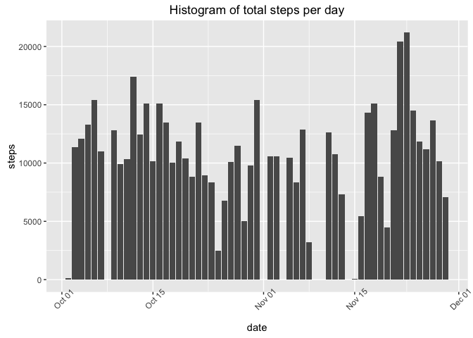
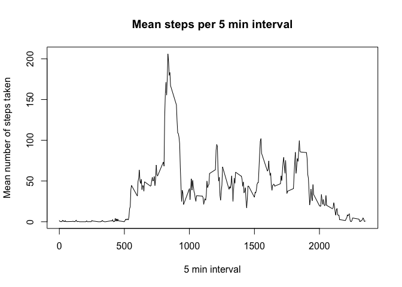
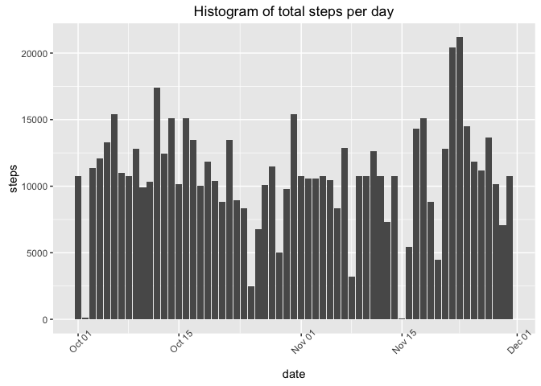
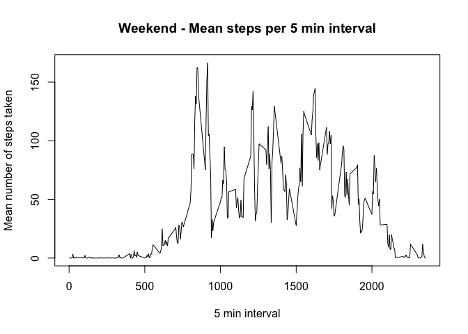
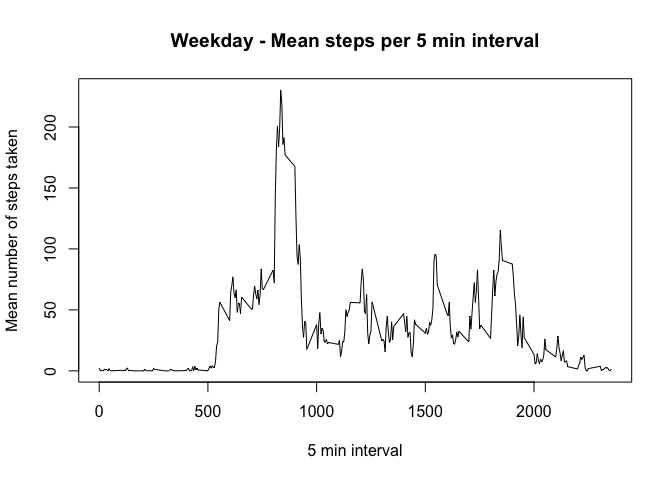

# Reproducible Research: Peer Assessment 1


## Loading and preprocessing the data
1. Clear any old variables and functions from the working space environment.

2. Unzip the data file from the git repository <http://github.com/rdpeng/RepData_PeerAssessment1>

```r
unzip("activity.zip")
#import the data, handle NAs
activity <- read.csv("activity.csv", sep=",", header=TRUE, na.strings=c("NA","NaN", " "))
```
3. convert date column from string values to date class


## What is mean total number of steps taken per day?
Aggregate data by total steps on a given day, ignoring NAs


1. Generate a histogram of total steps per day
<!-- -->

2. Calculate and report the mean and median total number of steps taken per day

The mean number of steps taken per day are 1.0766\times 10^{4} and the median number of steps are 1.0765\times 10^{4}


## What is the average daily activity pattern?
A time series plot (i.e. type = "l") of the 5-minute interval (x-axis) and the average number of steps taken, averaged across all days (y-axis)

<!-- -->


The 5-minute interval, from on average across all the days in the dataset, which contains the maximum number of steps is 835.


## Imputing missing values


1. The total number of missing values in the dataset (i.e. the total number of rows with NAs) is 2304.


2. Where a missing value (NA) was found in the interval column, the NA was replaced with the mean found for all corespondly matching 5 minute intervals.

```
##   steps       date interval
## 1    NA 2012-10-01        0
## 2    NA 2012-10-01        5
## 3    NA 2012-10-01       10
## 4    NA 2012-10-01       15
## 5    NA 2012-10-01       20
## 6    NA 2012-10-01       25
```

3. A histogram of the total number of steps taken each day 
<!-- -->
 
4. The calculated mean and median total number of steps taken per day:

Mean total = 1.0766\times 10^{4}
Median total = 1.0766\times 10^{4}


5. Do these values differ from the estimates from the first part of the assignment? 

```
## [1] "mean Steps with NA: 10766"
```

```
## [1] "mean Steps without NA: 10766"
```

```
## [1] "median Steps with NA: 10765"
```

```
## [1] "median Steps without NA: 10765"
```

```
## [1] " exact match."
```

6. What is the impact of imputing missing data on the estimates of the total daily number of steps?

The impact to altering the mean and median overall is negligible. However the impact to the data on days with NA values previously, gives an indication of activity where there was none successfully recorded before. 


## Are there differences in activity patterns between weekdays and weekends?
<!-- --><!-- -->

We can see that that for both weekends and weekdays the day starts with a lot of steps and then this reduces a lot for the rest of the day during the week. People appear more active during the day at weekends.

